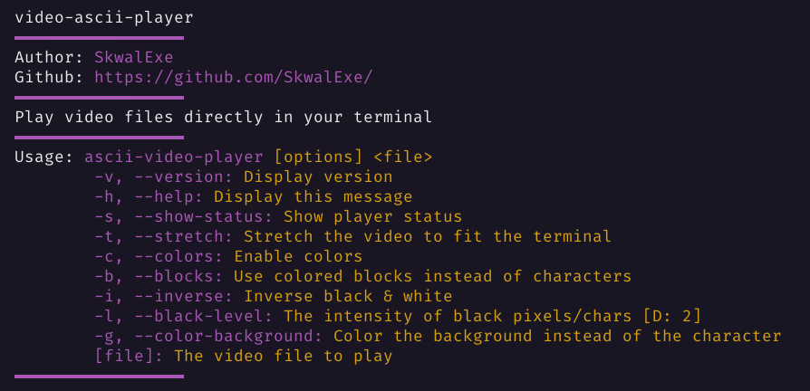

# Ascii-video-player 📺


Play video 📺 files in real time directly in your terminal.

# Installation 📦

## With make - Linux 🐧

Build

```bash
# 📂 ascii-video-player/
make
```

Add binary to bin folder

```bash
make install
```

### Build from source - Linux 🐧 & Windows 🪟

**Clone this repo**

```bash
git clone https://github.com/SkwalExe/ascii-video-player.git
```

Create a build folder

```bash
# 📂 ascii-video-player
mkdir build
cd build
```

Initialize CMake

```bash
# 📂 ascii-video-player

cmake ..
```

Build

```bash
# 📂 ascii-video-player
make
```


**[ LINUX ONLY ] :** Move the binary

```bash
# 📂 ascii-video-player
sudo cp ascii-video-player /usr/local/bin/
```

**On windows** the executable will be `build\ascii-video-player` you can move it wherever you want.

# Usage 📝



# Uninstall 🗑

## With make

Run make uninstall

```bash
# 📂 ascii-video-player
make uninstall
```

## Or

Just remove the binary

```bash
sudo rm /usr/bin/ascii-video-player
```

# final

If you have any problem, don't hesitate to open an issue

# contributing

Pull requests are welcome. For major changes, please open an issue first to discuss what you would like to change.

<a href="https://github.com/SkwalExe#ukraine"></a>